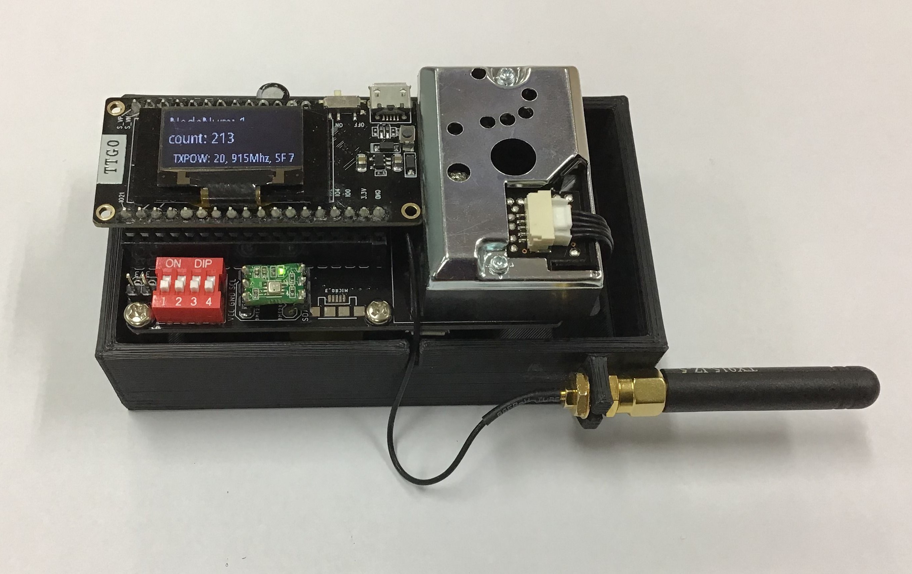
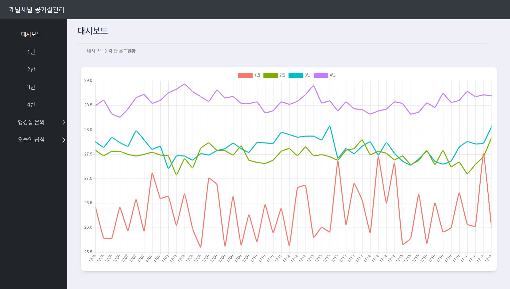

# Air-quality-monitoring-system
Air quality monitoring system based on LoRa and Node.JS

<!--  -->

LoRa Sensor Node

Node.JS Web Server

Hardware is based on TTGO-LoRa V2 board. Sensor nodes utilize BME280 and GP2y1024AU0F sensor and send it to the gateway via LoRa. Gateway will then upload the sensor data to the server via WiFi.

My system uses 4 sensor nodes and 1 gateway, but configurations can be changed

### Issues & To-Do lists
1. CLX1 pin on the ESP32 which is connected to pin 0 of the DIP switch maintains 2.7V, and prevents uploading when pulled up to 3.3V. Pin 2 of ESP32 should be changed to pin 0 of ESP32 since it's connected to the board LED
1. The PCB isn't long enough for the GP2Y10 dust sensor. And the 18650 battery blocks the hole for the sensor
1. 3.3V -> 5V boost converter is necessary since the GP2Y10 sensor utilizes 5V.
1. 3.3V and GND test pins should be moved to a different location